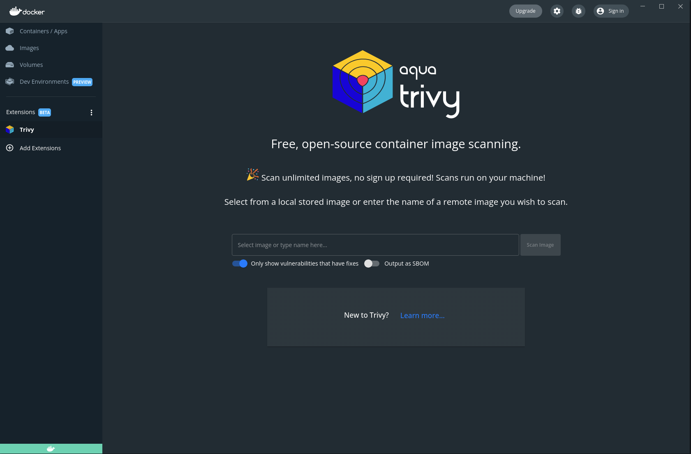
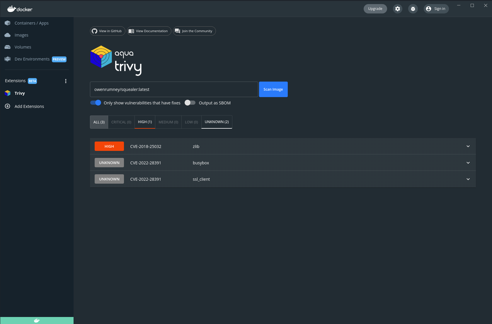

# Trivy Docker Extension

> :warning: NOT TO BE MADE PUBLIC BEFORE Docker Conference

## What is this?

Docker are adding the concept of `Extensions` to the Docker Desktop tool. This is an extension that allows the user to run Trivy and get pretty output in return.

The user can either select from a drop down of local images or type the name of an image into the drop down.




When you run the scan you'll get the results



## What is is made of?

The extension runs in its own container with a web interface that calls into the Docker extension API. At a high level the flow is;

1. specify an image
2. create the trivy cache volume if it does not already exist
3. run aquasec/trivy against the image providing the volume for docker.sock and the cache volume
4. process the json results and render

### But what is it made of?

Its something called [Svelte](https://svelte.dev/) which is a nice tool for creating Single Page Applications (SPAs) which get compiled down to a JS bundle and CSS bundle. This means its very lean for deploying as an image to the end user.

## How do I get started?

### Prereqs

You will need 

1. Docker Desktop release that supports extensions (currently private repo)
2. Docker Extension binary release (currently private repo)
3. NPM installed

## Local Dev

### Install packages

To install the required packages you'll need to run

```bash
npm install
```

### Build the App

To build the application we need to compile the svelte

*Linux/Mac*

```bash
make build-app
```

*Windows*

```bash
make.bat build-app
```

### Deploy to local Docker Desktop

To launch the extension into your Docker Desktop you'll need

*Linux/Mac*

```bash
make deploy-dev
```

*Windows*

```bash
make.bat deploy-dev
```

### Enable debugging in local Docker Desktop

To launch the extension into your Docker Desktop you'll need

*Linux/Mac*

```bash
make dev-debug
```

*Windows*

```bash
make.bat dev-debug
```

### Disable debugging in local Docker Desktop

To launch the extension into your Docker Desktop you'll need

*Linux/Mac*

```bash
make dev-reset
```

*Windows*

```bash
make.bat dev-reset
```