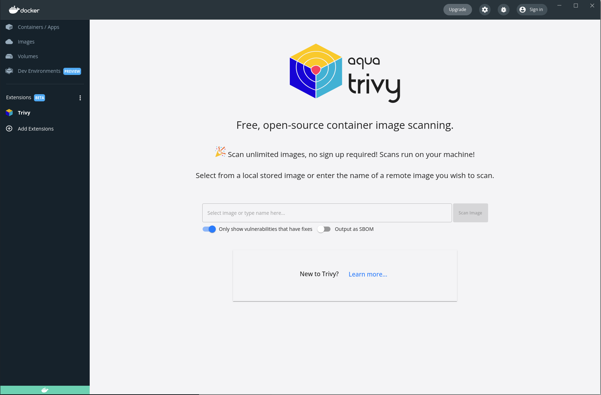

# Trivy Docker Extension


## What is this?

Docker are adding the concept of `Extensions` to the Docker Desktop tool. This is an extension that allows the user to run Trivy and get pretty output in return.

The user can either select from a drop down of local images or type the name of an image into the drop down.





When you run the scan you'll get the results


## What is is made of?

The extension runs in its own container with a web interface that calls into the Docker extension API. At a high level the flow is;

1. specify an image
2. create the trivy cache volume if it does not already exist
3. run aquasec/trivy against the image providing the volume for docker.sock and the cache volume
4. process the json results and render

### But what is it made of?

The extension is React app leveraging Material UI components. The Docker extension team have provided theme support so we just use that for the look and feel.

The source is all in `client/src` with the main component being [App.tsx](client/src/App.tsx). This has the core code for running the extension and loads all of the child components. 

The rest of the tsx files are detailed below

| Component                                       | Purpose                                                                                                                               |
|-------------------------------------------------|---------------------------------------------------------------------------------------------------------------------------------------|
| [DefaultDisplay](client/src/DefaultDisplay.tsx) | After the landing page has been used to initiate the first scan the view switches to the default display with the logo and search box |
| [ImageList](client/src/ImageList.tsx)           | Provides the functionality for loading the images stored locally and autocomplete functionality                                       |
| [Links](client/src/Links.tsx)                   | Header links for github, docs and slack                                                                                               |
| [Loading](client/src/Loading.tsx)               | The spinner loading blackout shim                                                                                                     |
| [Pill](client/src/Pill.tsx)                     | Coloured badges to denote the severity of the vulnerability                                                                           |
| [Success](client/src/Success.tsx)               | When the scan has no vulnerabilities this :tada: message is displayed                                                                 |
| [Vulns](client/src/Vulns.tsx)                   | Renders the Accordion "table" of results - this includes the [VulnsFilter](client/src/VulnsFilter.tsx)                                |
| [VulnsFilter](client/src/VulnsFilter.tsx)       | This control has the numbers of each severity and allows filtering the "table" of results                                             |
| [Welcome](client/src/Welcome.tsx)               | The Landing page - has the Trivy description and the initial scan                                                                     |


In addition to these there is the [TrivyVulnerability](client/src/TrivyVulnerability.tsx) which provides a class to represent a vulnerability from the Json results.

## How do I get started?

### Prereqs

You will need 

1. Docker Desktop release that supports extensions (currently private repo)
2. Docker Extension binary release (currently private repo)
3. NPM installed

## Local Dev

### Deploy to local Docker Desktop

To launch the extension into your Docker Desktop you'll need

*Linux/Mac*

```bash
make deploy-dev
```

*Windows*

```bash
make.bat deploy-dev
```

### Enable debugging in local Docker Desktop

To launch the extension into your Docker Desktop you'll need

*Linux/Mac*

```bash
make dev-debug
```

*Windows*

```bash
make.bat dev-debug
```

### Disable debugging in local Docker Desktop

To launch the extension into your Docker Desktop you'll need

*Linux/Mac*

```bash
make dev-reset
```

*Windows*

```bash
make.bat dev-reset
```

## CI Process

A bit about the CI process - on a new tag a release will be built for `linux/amd64` and `linux/arm64` using `docker buildx` with the multi arch builder.

The [release-extension target](Makefile) in the `Makefile` is fairly self explanatory and will push the new image. 

It's worth noting the installation of QEmu on the GitHub action worker so that it can build the `arm64` image - without that there are issues finding `glibc`.
